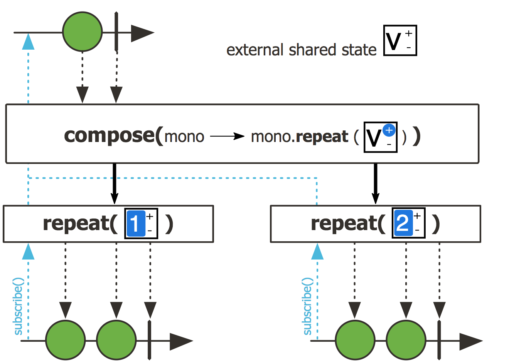
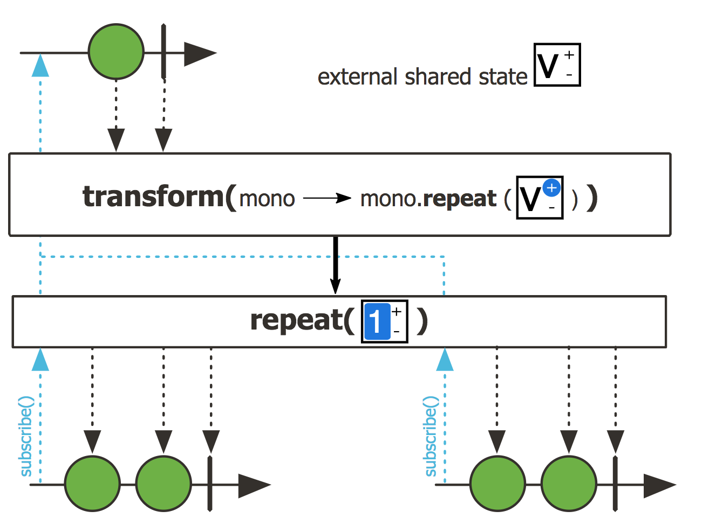
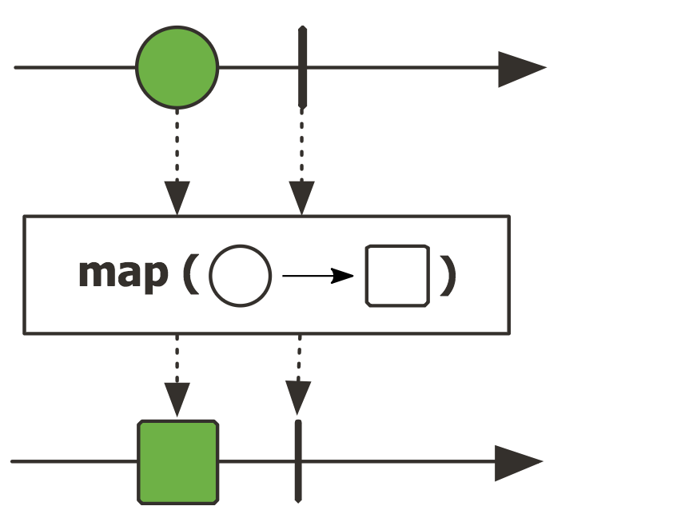
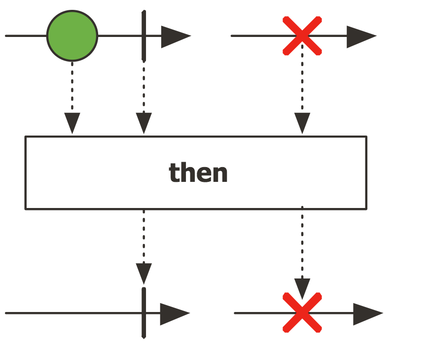

- `<V> Mono<V> compose(Function<? super Mono<T>,? extends Publisher<V>> transformer)`
  - 설명 : 타겟 Mono를 생성하기 위해서, 이 Mono에 지정된 transform을 연기해서 실행합니다. transform은 각 Publisher에 대해 발생합니다.
  - 파라미터 : transformer - 기존 Mono를 타겟 Mono에 즉시 매핑하는 Function
  - return : 새로운 Mono
  
  - [Javadoc](https://projectreactor.io/docs/core/release/api/reactor/core/publisher/Mono.html#compose-java.util.function.Function-)

- `Mono<V> transform(Function<? super Mono<T>,? extends Publisher<V>> transformer)` 
  - 설명 : 타겟 Mono를 생성하기 위해서 Mono를 변환합니다. `compose()`와 달리 제공된 함수는 어셈블리의 일부로 실행됩니다.
  - 파라미터 : transformer - Mono에 Subscribe 시 타겟 Mono 인스턴스에 Lazy Mapping 하는 기능
  - 리턴 : 새로운 Mono
  
  - [Javadoc](https://projectreactor.io/docs/core/release/api/reactor/core/publisher/Mono.html#transform-java.util.function.Function-)

- `
 P as(Function<? super Mono<T>,P> transformer)`
  - 설명 : 기존의 Mono를 받아서 새로운 타겟 Mono로 변환
  - 파라미터 : transformer - 기존 Mono를 타겟 Mono에 즉시 매핑하는 Function
  - 리턴 : P의 인스턴스로 변환 된 Mono
  - [Javadoc](https://projectreactor.io/docs/core/release/api/reactor/core/publisher/Mono.html#as-java.util.function.Function-)

- `map(Function<? super T,? extends R> mapper)` : 
  - 설명 : Syncrhonous 방식으로 Mono가 방출하는 항목을 변환합니다.
  - 파라미터 : mapper - Syncrhonous 방식 동작으로 변환하는 Function
  - 리턴 : 새로운 Mono
  
  - [Javadoc](https://projectreactor.io/docs/core/release/api/reactor/core/publisher/Mono.html#map-java.util.function.Function-)

- `Mono<Void> then()` : 
  - 설명 : Mono <Void>를 리턴해서, 이 Mono로부터 에러 신호만을 전달합니다.
  - 리턴 : 페이로드를 무시한 모노
  
  - [Javadoc](https://projectreactor.io/docs/core/release/api/reactor/core/publisher/Mono.html#then-java.util.function.Function-)

- [Stackoverflow: compose vs transform](https://stackoverflow.com/questions/48075824/difference-between-flux-compose-and-flux-transform)
> transform : eager, compose : lazy
~~~java
int[] counter = new int[1];
 Function transformer  = f -> {
     counter[0]++;

     return f;
 }

 Flux flux = flux Flux.just("")
     .transform(transformer);

 System.out.println(counter[0]);

 flux.subscribe();
 flux.subscribe();
 flux.subscribe();
 System.out.println(counter[0]);

 >>>
 1
 1
~~~
~~~java
 int[] counter = new int[1];
 Function transformer  = f -> {
     counter[0]++;

     return f;
 }

 Flux flux = flux Flux.just("")
     .compose(transformer);

 System.out.println(counter[0]);

 flux.subscribe();
 flux.subscribe();
 flux.subscribe();
 System.out.println(counter[0]);

 >>>
 0
 3
~~~

- [Stackoverflow: compose vs transform vs as vs map](https://stackoverflow.com/questions/47348706/compose-vs-transform-vs-as-vs-map-in-flux-and-mono)